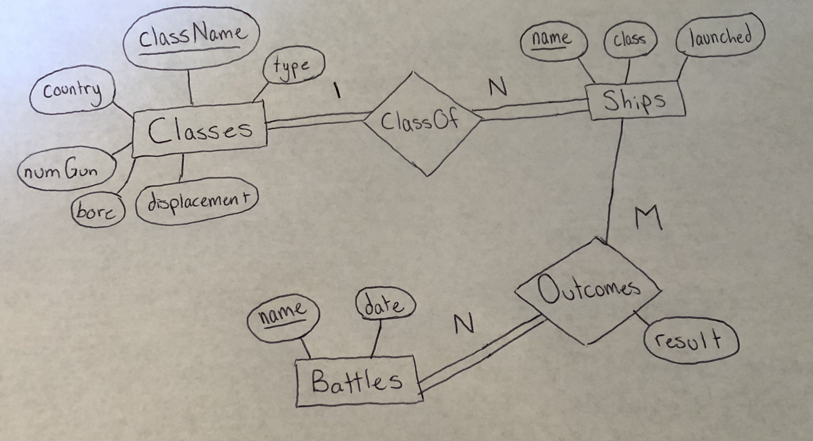

# capital-ships-api

A .NET Web API with CRUD operations against an SQLite DB.

To run in a docker container build:
```
docker build -t capital-ships-api -f Dockerfile .
```
then run on port 8080 (or any of your choice) of your local machine with:
```
docker run -ti --rm -p 8080:80 capital-ships-api
```

ER Diagram:
